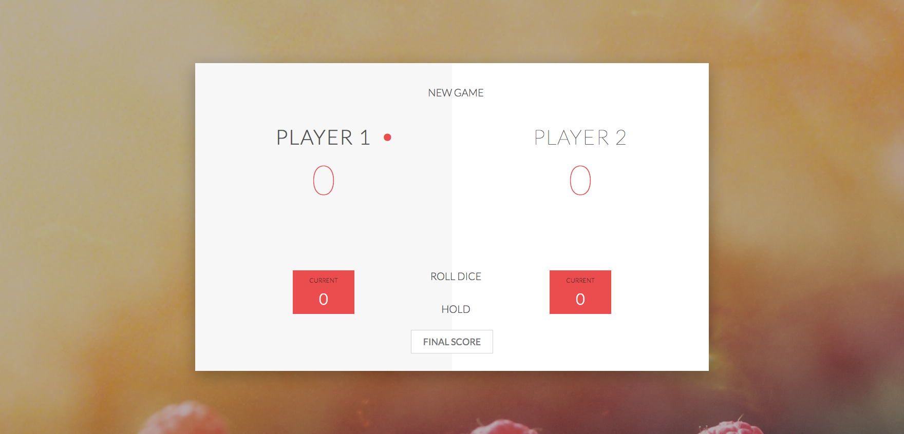

# dice-game

##How to Play
* The red dot next to the player name show who is rolling the dice. 
* Player click roll dice for dice to roll. Player can keep clicking roll dice for number to add up. 
* If player roll a 7 player loses turn and turn goes to the next player. 
* Player can click hold to add up all the score. 
* Score will be printed under player. 

##The Goal
* The goal is to have the most points. 
